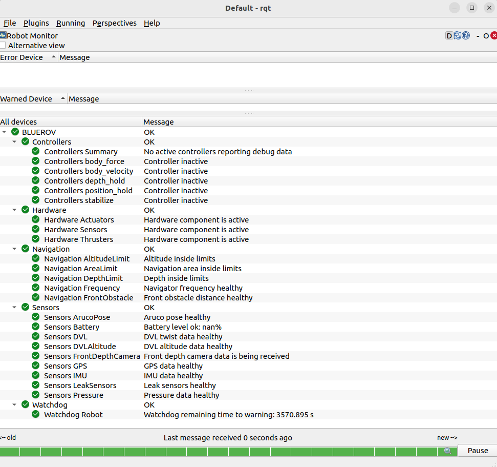

sura_diagnostics
================

``sura_diagnostics`` monitors the health of a SURA robot and publishes standard
ROS 2 diagnostics.

The package does not command the robot and does not decide autonomy behavior by
itself. Its role is to observe sensors, controllers, hardware state and
navigation safety limits, then report whether each part of the system is
``OK``, ``WARN``, ``ERROR`` or ``STALE``.

Role in SURA
------------

``sura_diagnostics`` answers questions such as:

- are the main sensors alive and publishing at the expected rate?
- is the navigation state fresh?
- is the robot inside the configured depth, altitude and area limits?
- are controllers updating within their expected timing?
- are the configured ``ros2_control`` hardware components active?
- is there a safety-critical condition such as a leak or battery warning?

All diagnostic nodes publish ``diagnostic_msgs/msg/DiagnosticArray`` on:

.. code-block:: text

   /diagnostics

When enabled, the package also launches ``diagnostic_aggregator``. This groups
the raw diagnostic statuses into a readable diagnostic tree on:

.. code-block:: text

   /diagnostics_agg

The aggregator does not create new checks. It reads the raw statuses already
published on ``/diagnostics`` and reorganizes them into categories, so tools such
as ``rqt_robot_monitor`` can show a cleaner tree instead of a flat list of many
diagnostic entries.

   Example ``rqt_robot_monitor`` view using the aggregated diagnostics tree.

.. raw:: html

   <svg class="bringup-flow" viewBox="0 0 980 230" role="img" aria-label="sura diagnostics data flow">
     <defs>
       <marker id="diagnostics-arrow" viewBox="0 0 10 10" refX="9" refY="5" markerWidth="7" markerHeight="7" orient="auto-start-reverse">
         <path d="M 0 0 L 10 5 L 0 10 z" fill="#5f7280"></path>
       </marker>
     </defs>

     <rect class="box" x="35" y="28" width="210" height="44" rx="6"></rect>
     <text x="140" y="55" text-anchor="middle">sensors</text>

     <rect class="box" x="35" y="92" width="210" height="44" rx="6"></rect>
     <text x="140" y="119" text-anchor="middle">controllers</text>

     <rect class="box" x="35" y="156" width="210" height="44" rx="6"></rect>
     <text x="140" y="183" text-anchor="middle">hardware and navigation</text>

     <rect class="box primary" x="340" y="72" width="245" height="78" rx="8"></rect>
     <text class="primary-label" x="462" y="104" text-anchor="middle">sura_diagnostics</text>
     <text class="small-label" x="462" y="126" text-anchor="middle">health and safety checks</text>

     <rect class="box source" x="680" y="42" width="245" height="58" rx="8"></rect>
     <text x="802" y="66" text-anchor="middle">/diagnostics</text>
     <text class="small-label" x="802" y="84" text-anchor="middle">raw DiagnosticArray</text>

     <rect class="box source" x="680" y="132" width="245" height="58" rx="8"></rect>
     <text x="802" y="156" text-anchor="middle">/diagnostics_agg</text>
     <text class="small-label" x="802" y="174" text-anchor="middle">grouped diagnostic tree</text>

     <path class="line" d="M245 50 H292 V96 H340" marker-end="url(#diagnostics-arrow)"></path>
     <path class="line" d="M245 114 H340" marker-end="url(#diagnostics-arrow)"></path>
     <path class="line" d="M245 178 H292 V126 H340" marker-end="url(#diagnostics-arrow)"></path>
     <path class="line" d="M585 96 H632 V71 H680" marker-end="url(#diagnostics-arrow)"></path>
     <path class="line" d="M585 126 H632 V161 H680" marker-end="url(#diagnostics-arrow)"></path>
   </svg>

Launch
------

``sura_diagnostics`` is normally launched from :doc:`sura_bringup <sura_bringup>`.
In the complete SURA system, the diagnostics profile is selected from the robot
bringup YAML:

.. code-block:: text

   <robot_namespace>_description/config/bringup_description.yaml

The relevant section is:

.. code-block:: yaml

   diagnostics:
     params_package: sura_diagnostics
     params: config/<diagnostics_profile>.yaml

``params_package``
   Package where the diagnostics YAML is installed.

``params``
   YAML file that defines which diagnostics are launched and how they are
   configured.

The selected YAML can be one of the existing profiles:

* ``config/diagnostics.yaml``
* ``config/blueboat_diagnostics.yaml``
* ``config/bluerov_diagnostics.yaml``
* ``config/cirtesub_diagnostics.yaml``

It can also be a custom diagnostics profile, for example:

.. code-block:: yaml

   diagnostics:
     params_package: <robot_namespace>_description
     params: config/my_custom_diagnostics.yaml

When the full robot is launched, ``sura_bringup.launch.py`` forwards this
selection to ``sura_diagnostics/diagnostics.launch.py``:

.. code-block:: bash

   ros2 launch sura_bringup sura_bringup.launch.py \
     robot_namespace:=<robot_namespace>

Relative topics in the YAML are resolved under the robot namespace. For example,
``navigator/navigation`` becomes:

.. code-block:: text

   /<robot_namespace>/navigator/navigation

Absolute topics, such as ``/diagnostics``, are kept unchanged.

Configuration File
------------------

Diagnostics are configured from YAML profiles in:

.. code-block:: text

   sura_diagnostics/config/

The main sections are:

``aggregator``
   Enables and configures ``diagnostic_aggregator``. The default tree groups
   statuses into ``Controllers``, ``Navigation``, ``Sensors``, ``Hardware`` and
   ``Watchdog``.

   ``diagnostic_aggregator`` subscribes to ``/diagnostics`` and republishes a
   grouped view on ``/diagnostics_agg``. In SURA, the diagnostic nodes publish
   names such as ``/Sensors/IMU`` or ``/Navigation/Limits``. The aggregator uses
   rules such as ``startswith: [/Sensors]`` to place those statuses under the
   matching group.

   The most relevant fields are:

   ``enabled``
      Starts or disables the aggregator.

   ``path``
      Root name of the aggregated tree. If it is empty, the launch file uses the
      robot namespace in uppercase.

   ``pub_rate``
      Publication frequency of ``/diagnostics_agg``. This only changes how often
      the grouped diagnostic tree is republished; it does not change the
      publication frequency of the original diagnostic nodes on ``/diagnostics``.

   ``controllers``, ``navigation``, ``sensors``, ``hardware`` and ``watchdog``
      Analyzer groups. Each group uses ``diagnostic_aggregator/GenericAnalyzer``
      and defines which raw diagnostic names belong to that group.

``diagnostics``
   Starts standalone diagnostic nodes. These are used for controller timing,
   navigation safety limits, battery, hardware components, leak sensors and the
   robot watchdog.

``sensors``
   Starts sensor diagnostics. These entries can also create throttled topics
   with ``topic_tools/throttle`` so the diagnostic node can validate a slower
   topic while measuring frequency on the raw topic.

General Diagnostics
-------------------

``controller_debug_diagnostics``
   Monitors ``controller/debug`` from :doc:`sura_controllers <sura_controllers>`.
   It checks controller cycle time, stale debug data and deadline misses.

``navigation_limits_diagnostics``
   Monitors the :doc:`sura_navigator <sura_navigator>` output. It checks
   freshness, publication frequency, maximum depth, minimum altitude and allowed
   operating radius. It also publishes ``sura_msgs/msg/NavigationSafety`` on:

   .. code-block:: text

      /<robot_namespace>/safety/navigation

   The safe area is configured in the diagnostics YAML. It is modeled as a
   horizontal circular area plus vertical limits: the robot must stay inside a
   radius around ``center_x`` and ``center_y``, above the minimum altitude from
   the bottom and above the maximum allowed depth.

   .. code-block:: yaml

      navigation_limits_diagnostics:
        parameters:
          max_depth: 4.0
          depth_warning_margin: 0.5
          min_altitude: 0.3
          altitude_warning_margin: 0.5
          center_x: 0.0
          center_y: 0.0
          max_radius: 4.0
          radius_warning_margin: 0.5

   These values can be changed for each robot or test area:

   ``max_depth``
      Maximum allowed depth. If the robot goes deeper than this, the diagnostic
      reports ``ERROR``.

   ``depth_warning_margin``
      Distance before ``max_depth`` where the diagnostic starts reporting
      ``WARN``.

   ``min_altitude``
      Minimum allowed altitude over the bottom. If the robot is closer to the
      bottom than this, the diagnostic reports ``ERROR``.

   ``altitude_warning_margin``
      Distance before ``min_altitude`` where the diagnostic starts reporting
      ``WARN``.

   ``center_x`` and ``center_y``
      Center of the allowed horizontal operating area.

   ``max_radius``
      Maximum allowed horizontal distance from ``center_x`` and ``center_y``.
      If the robot leaves this radius, the diagnostic reports ``ERROR``.

   ``radius_warning_margin``
      Distance before ``max_radius`` where the diagnostic starts reporting
      ``WARN``.

``battery_status_diagnostics``
   Monitors ``sensor_msgs/msg/BatteryState`` and checks battery presence,
   percentage and current draw limits.

``hardware_components_diagnostics``
   Calls the controller manager ``list_hardware_components`` service and checks
   that the configured hardware components are active. The default components
   are thrusters, sensors and actuators.

``leak_sensors_diagnostics``
   Monitors the leak sensor topic and reports stale data or active leak
   detection.

``robot_watchdog``
   Publishes a robot-level watchdog state. It warns when the robot has been
   running for too long without a reset and publishes
   ``sura_msgs/msg/RobotWatchdog`` on:

   .. code-block:: text

      /<robot_namespace>/safety/robot_watchdog

   It also provides a private reset service named ``~/reset``.

Sensor Diagnostics
------------------

Sensor diagnostics share the same structure:

``sensor_topic``
   Topic used to validate the latest sensor message. In the default YAML this is
   usually a throttled topic.

``frequency_topic``
   Raw topic used to measure the real publication frequency.

``publish_period``
   How often the diagnostic status is published.

``stale_timeout``
   Maximum allowed age before the diagnostic becomes ``STALE``.

``warn_min_frequency_hz`` and ``error_min_frequency_hz``
   Frequency thresholds used to report ``WARN`` or ``ERROR``.

Available sensor diagnostics:

``gps_diagnostics``
   Checks GPS fix validity, coordinate range and frequency.

``imu_diagnostics``
   Checks finite IMU values, quaternion norm, covariance and frequency.

``dvl_diagnostics``
   Checks DVL velocity validity, covariance and frequency.

``dvl_altitude_diagnostics``
   Checks DVL altitude range validity, bounds and frequency.

``pressure_diagnostics``
   Checks pressure validity, pressure variance, conversion parameters and
   frequency.

Diagnostic Levels
-----------------

The package uses the standard ROS 2 diagnostic levels:

``OK``
   The signal is fresh and inside the configured limits.

``WARN``
   The signal is degraded, close to a configured limit or below the warning
   frequency.

``ERROR``
   The signal is invalid or outside a critical limit.

``STALE``
   No recent data has been received.

Useful Checks
-------------

Check raw diagnostics:

.. code-block:: bash

   ros2 topic echo /diagnostics --once

Check the aggregated diagnostic tree:

.. code-block:: bash

   ros2 topic echo /diagnostics_agg --once

Check navigation safety:

.. code-block:: bash

   ros2 topic echo /<robot_namespace>/safety/navigation --once

Check the robot watchdog:

.. code-block:: bash

   ros2 topic echo /<robot_namespace>/safety/robot_watchdog --once
