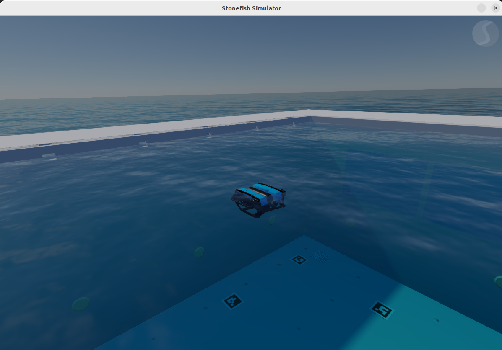
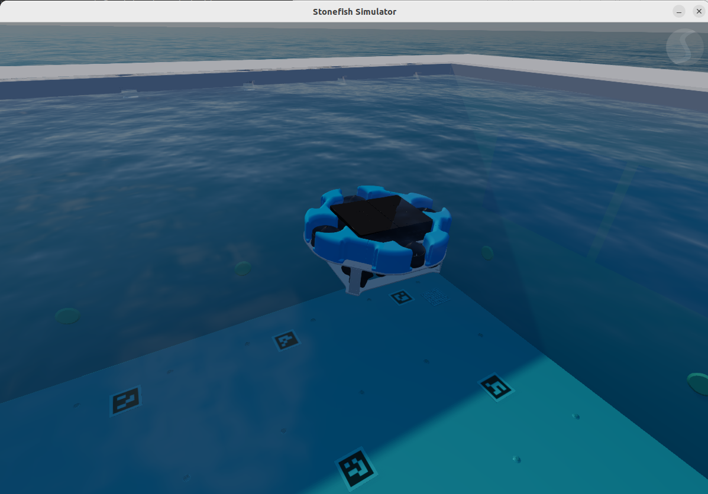
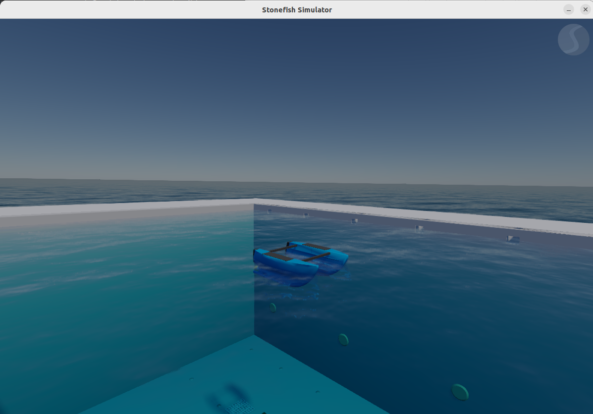
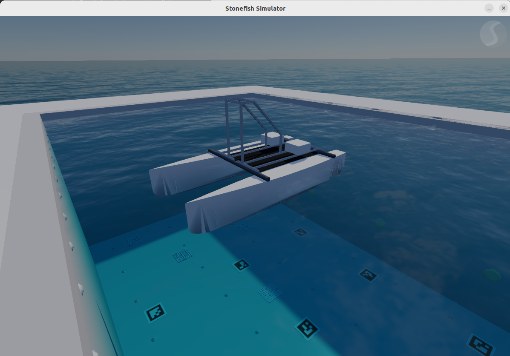
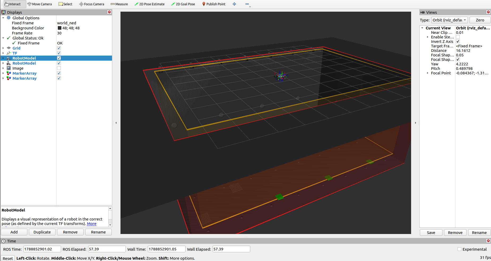

Simulation
==========

SURA can also be used with `Stonefish <https://stonefish.readthedocs.io/en/latest/>`_
to test the robot in simulation before running it on real hardware.

This setup uses Docker and requires a computer with an NVIDIA GPU and the NVIDIA
container runtime installed.

Create a Simulation Folder
--------------------------

First create a folder for the simulation files and enter it:

.. code-block:: bash

   mkdir -p sura_simulation
   cd sura_simulation

Create the Docker Compose File
------------------------------

Create the ``docker-compose.yml`` file inside the ``sura_simulation`` folder:

.. code-block:: bash

   nano docker-compose.yml

Paste this content:

.. code-block:: yaml

   services:
     sura_stonefish:
       image: inesperez03/sura-stonefish-ros2-humble:latest
       container_name: sura_stonefish

       network_mode: host
       ipc: host

       stdin_open: true
       tty: true

       environment:
         NVIDIA_DRIVER_CAPABILITIES: all
         DISPLAY: ${DISPLAY}
         XDG_RUNTIME_DIR: /tmp/runtime-root
         SDL_VIDEODRIVER: x11
         ROS_DOMAIN_ID: 4
         RMW_IMPLEMENTATION: rmw_cyclonedds_cpp

       volumes:
         - /tmp/.X11-unix:/tmp/.X11-unix:rw
         - /dev/input:/dev/input

       device_cgroup_rules:
         - "c 13:* rmw"

       deploy:
         resources:
           reservations:
             devices:
               - driver: nvidia
                 count: all
                 capabilities: [gpu]

       command: >
         bash -lc "
           if [ ! -d /root/sura_ws_meta ]; then
             git clone https://github.com/slopezba/sura_ws_meta.git /root/sura_ws_meta &&
             cd /root/sura_ws_meta &&
             source /opt/ros/humble/setup.bash &&
             mkdir -p src &&
             vcs import src < workspace.repos &&
             colcon build
           fi &&
           sleep infinity
         "

This example uses ``ROS_DOMAIN_ID=4`` and Cyclone DDS:

.. code-block:: yaml

   ROS_DOMAIN_ID: 4
   RMW_IMPLEMENTATION: rmw_cyclonedds_cpp

Start the Container
-------------------

Allow Docker to open graphical windows:

.. code-block:: bash

   xhost +si:localuser:root

Start the container:

.. code-block:: bash

   docker compose up -d

Check that it is running:

.. code-block:: bash

   docker ps

Open Terminals Inside Docker
----------------------------

Open three different terminals on the host. In each one, enter the container:

.. code-block:: bash

   docker exec -it sura_stonefish bash

Terminal 1: Launch the Simulation
---------------------------------

Inside the first Docker terminal, prepare the environment:

.. code-block:: bash

   cd /root/sura_ws_meta
   source /opt/ros/humble/setup.bash
   source install/setup.bash

Then launch one simulation. Use only one of these commands:

.. code-block:: bash

   ros2 launch bluerov_stonefish bluerov_cirtesu.launch.py

.. code-block:: bash

   ros2 launch cirtesub_stonefish cirtesub_cirtesu.launch.py

.. code-block:: bash

   ros2 launch blueboat_stonefish blueboat_cirtesu.launch.py

.. code-block:: bash

   ros2 launch catamaran_stonefish catamaran_cirtesu.launch.py

Terminal 2: Launch SURA
-----------------------

Inside the second Docker terminal, launch SURA. Replace ``robot_name`` with the
namespace for the robot that is running in Stonefish:

.. list-table::
   :header-rows: 1

   * - Simulation
     - ``robot_name``
   * - BlueROV
     - ``bluerov``
   * - CIRTESUB
     - ``cirtesub``
   * - BlueBoat
     - ``blueboat``
   * - Catamaran
     - ``catamaran``

.. code-block:: bash

   cd /root/sura_ws_meta
   source /opt/ros/humble/setup.bash
   source install/setup.bash
   ros2 launch sura_bringup sura_bringup.launch.py robot_namespace:=robot_name

Terminal 3: Launch Teleoperation
--------------------------------

Inside the third Docker terminal, launch the ground control station. This starts
RViz and the joystick teleoperation tools from :doc:`packages/sura_teleop`:

.. code-block:: bash

   cd /root/sura_ws_meta
   source /opt/ros/humble/setup.bash
   source install/setup.bash
   ros2 launch sura_bringup sura_gcs.launch.py robot_namespace:=robot_name

